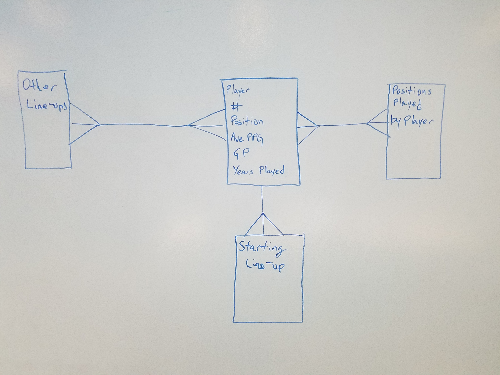

#ADI Project Two
###Player Roster Application
####by: mike marshall
###### aka @emploYeezy

Project Details:
######This is a simple applitcation that showcases the use of a single table database, basic search funtionality, and a novice coders attempt at making a usable and persistent application.   

theBluePrint:

theERD:

theERD(depricated):

#Manual Tests!
######eightToBePrecise

1. When a user clicks search, a qwerty keyboard should appear to allow them to type a search. 
2. If a user clicks the back button, the data should presist.
3. When a user clicks a Player's name more information should become available.
4. Information should remain constant on the player profile page, no matter where a user clicks from.
5. A search for Guards should result in four current players who are listed as Guards being listed.
6. A search for Forward should result in the 6 forwards on the roster being presented. 
7. A search for Integers should function based on rookie year. 
8. Starters should be able to be presented on their own list, which can be clicked through to a detail page.